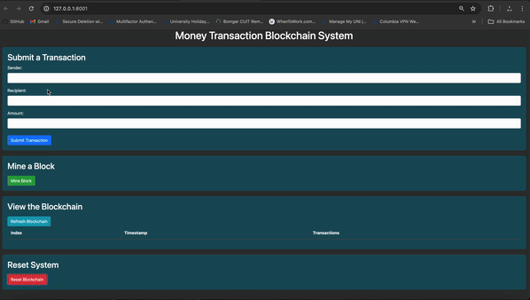

[](https://classroom.github.com/a/-Lgd7v9y)

# CSEE 4119 Spring 2024, Class Project

## Team name: Group28
### Team members : Only one work on this project
- Name: Noel Chan Zin
  GitHub username: channyeinzin

## Introduction

Many sectors, including finance, medicine, manufacturing, and education, utilize blockchain applications to benefit from the unique characteristics of this technology. Blockchain technology (BT) offers advantages in trustability, collaboration, organization, identification, credibility, and transparency. In this project, we analyze how open science can leverage blockchain technology and its properties. We determine the requirements of an open science ecosystem and compare them with the characteristics of BT to demonstrate that the technology serves as a suitable infrastructure. Specifically, we use blockchain for secure transactions of money between friends.

## Blockhash

A Block Hash serves as a reference number for a block in the blockchain. It is a one-way encrypted message generated using a hash function. The hash function takes some data as input and produces a unique identifier known as a "digest" or "signature." Even a slight change in the input data results in a significantly different output identifier. This cryptographic technique ensures the security of transactions within the blockchain.

## Project Workflow:
Setup: The project requires Flask and Python 3.8 or higher. Once set up, the team initiates the Flask server to enable blockchain functionality.
Transaction Submission: Users input sender, recipient, and amount details to submit a transaction. This transaction data is securely processed using blockchain technology.
Block Mining: Miners in the network validate transactions and add them to the blockchain through the mining process. This ensures the integrity and security of the blockchain.
Blockchain Viewing: Users can view the blockchain to track transactions and ensure transparency. Each block contains essential information such as index, timestamp, and transaction details.
Reset Functionality: The project incorporates a reset feature to clear the blockchain and start afresh if necessary.

## Technologies Used:
Frontend: HTML
Backend: Python with Flask framework
Blockchain Concepts: Blockhash, Block Mining, Secure Transactions
Development Environment: Visual Studio Code


## Requirements

### Software Requirements:
- IDE: Visual Studio Code
- Flask
- Python 3.8 or higher

## How to Run

1. Install Flask.
2. Navigate to the project directory.
3. Run `python tracker.py [portnumber]` in one terminal window.
4. Open another terminal window and navigate to the project directory.
5. Edit the port number in the `app.py` file to match the port used in `track.py`.
6. Run `python app.py --flask_port [port_number] --p2p_port [port_number]` in the second terminal window.

## How to Check Registered Port Number List

Access the following URL in your web browser:
```
http://127.0.0.1:[port_number]/list
```
Replace `[port_number]` with the port number used in `track.py`.

## How to Use

1. Enter the name of the sender.
2. Enter the name of the recipient.
3. Enter the amount.
4. Click "Submit Transaction."
5. After submission, an alert box will appear. Click "OK."
6. Go to "Mine a Block" and click on "Mine Block."
7. After mining, another alert box will appear. Click "OK."
8. View the results in "View the Blockchain."
9. To reset, click on "Reset Blockchain."

## Demo Screenshots

